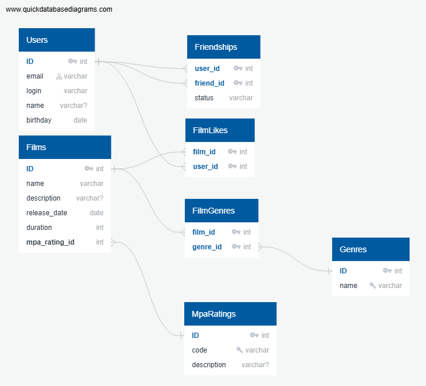

# java-filmorate
Template repository for Filmorate project.


## Схема базы данных Filmorate



### Пояснение

- Таблица `Users` хранит информацию о пользователях.
- Таблица `Films` — фильмы с ссылкой на рейтинг MPA (`MpaRatings`) и жанры (`Genres` через `FilmGenres`).
- Таблица `Friendships` хранит связи между пользователями с атрибутом `status` (UNCONFIRMED / CONFIRMED).
- Таблица `FilmLikes` — лайки пользователей фильмов.
- Таблицы `Genres` и `MpaRatings` — справочники для нормализации данных.

### Примеры запросов

- Получить топ 10 популярных фильмов:

```sql
SELECT f.name, COUNT(fl.user_id) AS likes_count
FROM Films f
LEFT JOIN FilmLikes fl ON f.ID = fl.film_id
GROUP BY f.ID
ORDER BY likes_count DESC
LIMIT 10;